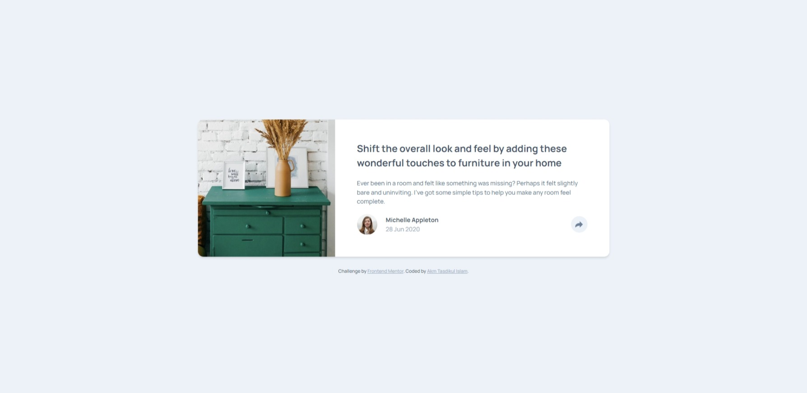
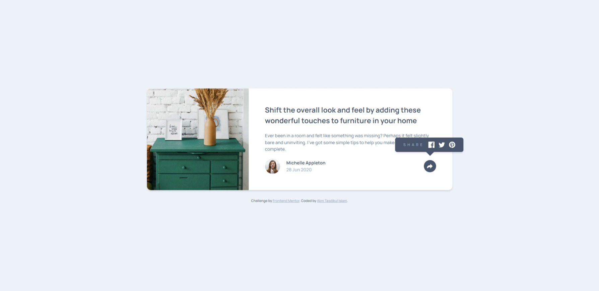
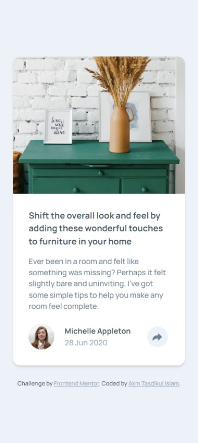
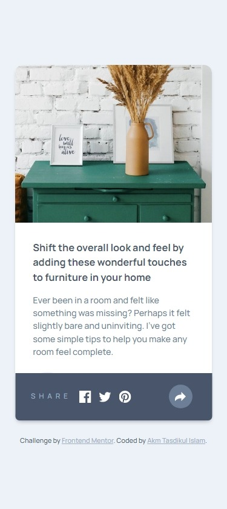

# Frontend Mentor - Article preview component solution

This is a solution to the [Article preview component challenge on Frontend Mentor](https://www.frontendmentor.io/challenges/article-preview-component-dYBN_pYFT). Frontend Mentor challenges help you improve your coding skills by building realistic projects.

## Table of contents

- [Overview](#overview)
  - [The challenge](#the-challenge)
  - [Screenshot](#screenshot)
  - [Links](#links)
- [My process](#my-process)
  - [Built with](#built-with)
  - [What I learned](#what-i-learned)
  - [Useful resources](#useful-resources)
- [Author](#author)

## Overview

Project Start Date: 02 January 2024
Project End Date: 04 January 2024
Project Duration: 02 Days

### The challenge

Users should be able to:

- View the optimal layout for the component depending on their device's screen size
- See the social media share links when they click the share icon

### Screenshot

<div>
  <div id="desktop-version" style="display:flex; flex-direction:row; align-items:center; gap:10px">
    
    
  </div>
  <div id="mobile-version" style="display:flex; flex-direction:row; align-items:center; gap:10px; margin-top:10px;">
    
    
  </div>
</div>

### Links

- [Solution URL](https://github.com/akmtasdikulislam/article-preview-component)
- [Live Site URL](https://akmtasdikulislam.github.io/article-preview-component/)

## My process

- First I added the css file and font into index.html using `<link>` tag.

```html
<link rel="stylesheet" href="styles.css" />
<link rel="preconnect" href="https://fonts.googleapis.com" />
<link rel="preconnect" href="https://fonts.gstatic.com" crossorigin />
<link
  href="https://fonts.googleapis.com/css2?family=Manrope:wght@500;700&display=swap"
  rel="stylesheet"
/>
```

- Then I added the necessary color, font and initialized the `style.css` file.

```css
:root {
  --dark-blue: hsl(214, 17%, 51%);
  --dark-grayish-blue: hsl(217, 19%, 35%);
  --grayish-blue: hsl(212, 23%, 69%);
  --light-grayish-blue: hsl(210, 46%, 95%);

  font-size: 13px;
}
/* Initialization */
*,
::before,
::after {
  box-sizing: border-box;
  font-family: "Manrope", serif;
  margin: 0;
  padding: 0;
}
```

- After this, first of all I developed desktop-version UI using **HTML** code and then added necessary styles to match the given desktop UI design.
- Then again developed the _active-state_ UI of desktop-version using **HTML** code and followed the design sample using **CSS**.
- Then I added necessary **Javascript** code to make the _share-button_ functional. I also added an invisible overlay `<div>` in `<body>`.

```html
<div id="invisible-overlay"></div>
```

It will be displayed _flex_ when _share-button_ is clicked.

```js
    const shareButton = document.querySelector(".share-button");
    const invisibleOverlay = document.getElementById("invisible-overlay");

shareButton.addEventListener("click", () => {
     invisibleOverlay.style.display = "block";
    //  ... rest of the code.
     }
```

And also it will be displayed _none_ when user click on it (outside of _share-tooltip_).

```js
invisibleOverlay.addEventListener("click", () => {
  invisibleOverlay.removeAttribute("style");
  // ... rest of the code

  // Also removing eventListener from invisivleOverlay
  invisibleOverlay.removeEventListener("click", () => {});
});
```

- After developing desktop-version UI, I followed the same process to develop mobile-version UI. Here I used css _media-query_ for mobile-version UI development.

```css
@media (max-width: 375px);
```

- To make _share-button_ functional on mobile-version (as mobile-version _active-state_ is different than desktop-version) I differentiated the onClick task (only the first-step) of _share-button_ using _if condition_ which everytime checks the viewport size and if it is less or equals to _375px_ it will execute mobile-version _share-button_ task otherwise it will execute desktop-version _share-button_ task.

```js
if (window.innerWidth <= "375") {
  // --Mobile-Version--

  // Step 01: changing shareButton color to distinguish it as active.
  shareButton.style.backgroundColor = "var(--dark-blue)";
  // Also pushing it downward to position it vertically center with the shareTooltip
  shareButton.style.transform = "translateY(-10%)";
} else {
  // --Desktop-Version--

  // Step 01: changing shareButton color to distinguish it as active.
  shareButton.style.backgroundColor = "var(--dark-grayish-blue)";
}
```

### Built with

- Semantic HTML5 markup
- CSS custom properties
- Javascript

### What I learned

By doing this project,

- I learnt how to apply different desktop & mobile version UI desing using _Javascript_.
- Also learnt how to get _viewport width_ using _Javascript_.
- Also learnt that when we add some _css_ modifications to any _HTML element_, it is applied to it as **inline-css**. So only removing the _style attribute_, we can remove all the modifications.
- Also learnt how to show & hide a tooltip using _Javascript_

### Useful resources

- [How to get the browser viewport dimensions?](https://stackoverflow.com/questions/1248081/how-to-get-the-browser-viewport-dimensions) - This helped me to get the `viewport-width` of the client (browser).

## Author

- Website - [Akm Tasdikul Islam](https://github.com/akmtasdikulislam)
- Frontend Mentor - [@yourusername](https://www.frontendmentor.io/profile/akmtasdikulislam)
